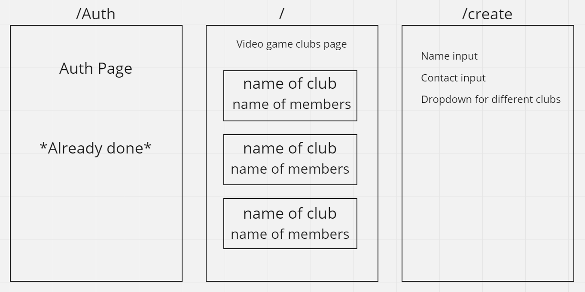

# Plan

1. Database Setup

Add two tables

-Add test data to video games / participants
-Add RLS so that only authenticated users can do anything with the data (select, update, delete,create)
-video games => enable read for all users
-competitors =>
-enable read for all users
-insert authenticated only
-delete authenticated only

2. (landing page) Video Games Pages

    -getVideoGames function (fetch all of the video games and their competitors)
    -render function that displays the games
    -loop through games and display

3. Create Page (separate page!)

    -HTML -> form elements with inputs for name, contact, placeholder <select> for video games
    -get our games (getVideoGames) and dynamically add <option> to select
    -Add createMember function to fetch-utils
    -add event for the form submit, grabbing the form data and sending it to supabase (calling createCompetitor)

4. Delete Competitor (on games page)

    -add deleteCompetitor(id) in fetch-utils
    -make member element clickable & delete on click
